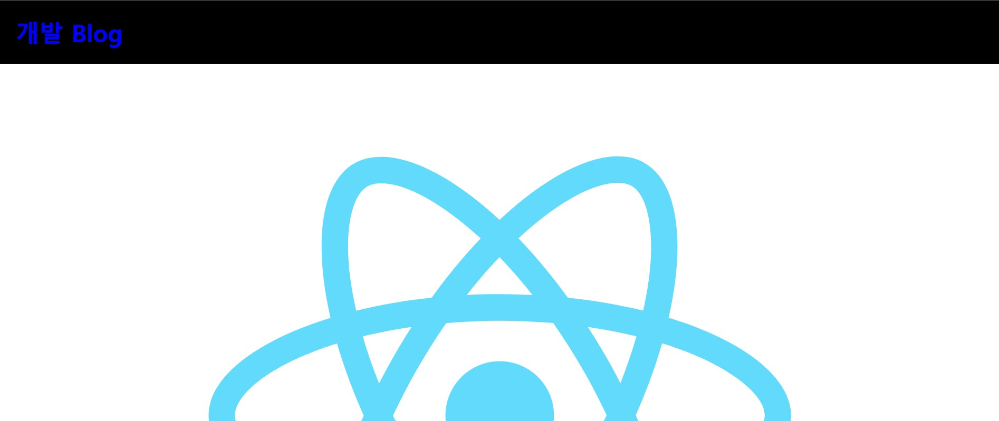
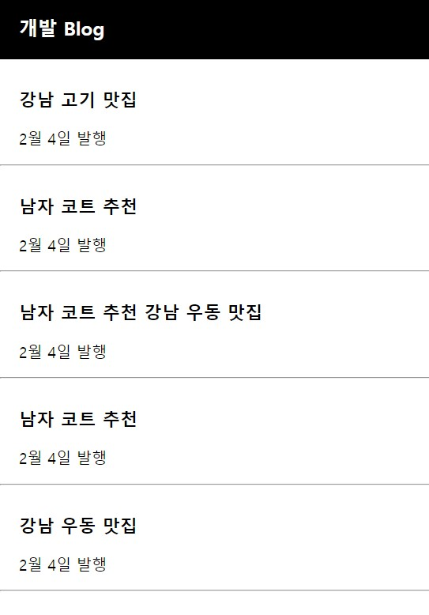

# **Project - blog** 🙂

 ## 💡 `react` PROJECT 


---

### 🧾 프로젝트 소개 

---

>**환경 구축**

> 1. Visual Studio 설치
> 2. Node.js 설치


```
npx create-react-app blog
```
 
---

## JSX문법 
```
1) class 대신 className으로 사용
2) 데이터 바인딩
```



<br>

---

## state
```
1) 데이터를 변수에 넣어 사용
2) 데이터를 state에 넣어 사용
    -> state에 데이터를 저장해 놓는 이유
        : 웹이 App처럼 동작하게 하기 위해
        => state가 변경되면 HTML이 자동으로 재렌더링 된다.
          (새로고침 없이도 HTML에 렌더링 ▷ HTML이 새로고침 없이도 스무스하게 변경 된다.)
            (그냥 변수는 변경하면 자동 재렌더링이 되지 않고, 새로고침을 통해 재렌더링 된다.)
```
▶ 자주 바뀌는, 중요한 데이터는 변수 말고 `state`로 저장해서 사용.


