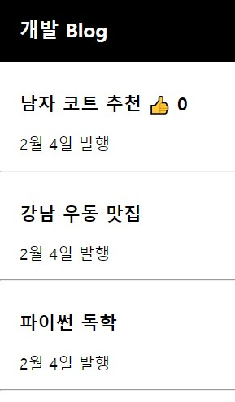
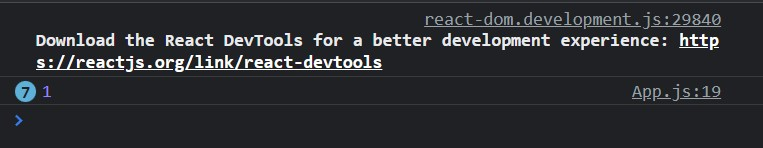
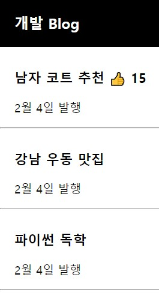

# **Project - blog** 🙂

 ## 💡 `react` PROJECT 


---

### 🧾 프로젝트 소개 

---

>**환경 구축**

> 1. Visual Studio 설치
> 2. Node.js 설치


```
npx create-react-app blog
```
 
---

### JSX문법 
```
1) class 대신 className으로 사용
2) 데이터 바인딩
```


<br>

---

### state
```
1) 데이터를 변수에 넣어 사용
2) 데이터를 state에 넣어 사용
    -> state에 데이터를 저장해 놓는 이유
        : 웹이 App처럼 동작하게 하기 위해
        => state가 변경되면 HTML이 자동으로 재렌더링 된다.
          (새로고침 없이도 HTML에 렌더링 ▷ HTML이 새로고침 없이도 스무스하게 변경 된다.)
            (그냥 변수는 변경하면 자동 재렌더링이 되지 않고, 새로고침을 통해 재렌더링 된다.)
```
▶ 자주 바뀌는, 중요한 데이터는 변수 말고 `state`로 저장해서 사용.

##### warning 문구 없애기
###### 위험할 수 있으니, 사용 시 주의
```
/* eslint-disable */
```


---

### 좋아요 기능
 <br>
- TEST <br>
    
    ```
    이모티콘을 누를 때마다 1 콘솔창에 표시
    ```

- PLAY <br>
     <br>
    ```
    // [state, state변경함수]
    let [best, best_v] = useState(0);

    onClick={ () => { best_v(best + 1) }}
    ```
---

### 제목 바꾸기(deep copy 사용)
```
수정된 [데이터]를 만들기
▷ state의 복사본을 만들어서 수정
▷▷ deep copy해서 수정
───────────────────────────────────
<reference data type>
let [title, b_title] = useState(['남자 코트 추천', ' 강남 우동 맛집', '파이썬 독학']);
var newTitle = title;
    newTitle[0] = '여자 코트 추천';
───────────────────────────────────
<deep copy>
// 값 공유X -> 서로 독립적인 값을 가지고 복사
let [title, b_title] = useState(['남자 코트 추천', ' 강남 우동 맛집', '파이썬 독학']);
var newTitle = [...title]; // ... -> spread operator(중괄호, 대괄호 제거)
                           // object도 ()중괄호 써서 deep copy 가능
    newTitle[0] = '여자 코트 추천';
───────────────────────────────────
* 리액트 대 원칙 : immutable data -> state 데이터가 직접 수정이 되면 안 된다.
```

 <br>